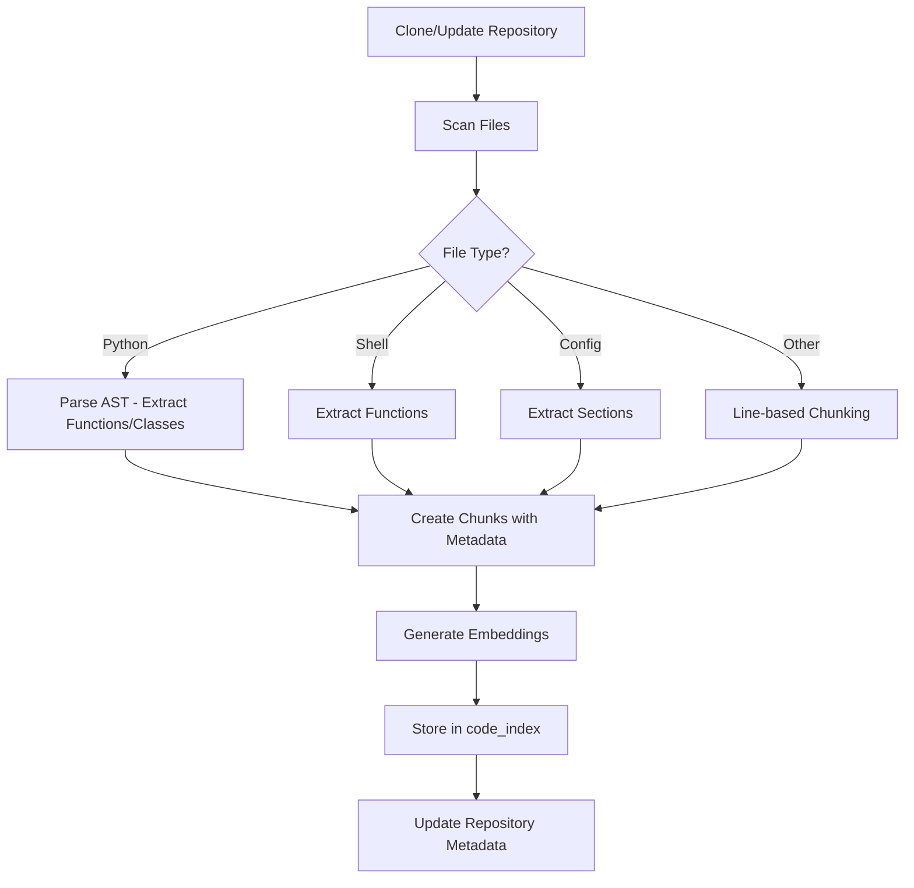
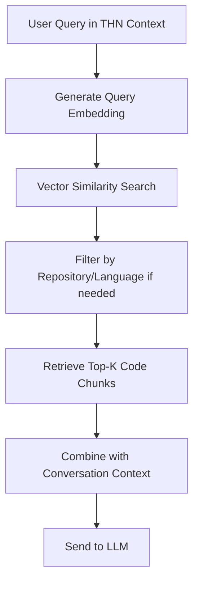

# Data Model: THN Code RAG Pipeline

**Feature**: 008-thn-code-rag-pipeline  
**Date**: 2025-01-27

## Overview

This document outlines the data model for indexing THN repository code and enabling semantic code retrieval. The primary entity is the `code_index` table which stores code chunks with vector embeddings for similarity search.

## Entities and Relationships

### 1. code_index Table (NEW)

**Purpose**: Store code chunks from THN repositories with embeddings for semantic search.

| Column | Type | Constraints | Notes |
|--------|------|-------------|-------|
| id | UUID | PRIMARY KEY, NOT NULL | Unique identifier for each code chunk |
| repository_name | TEXT | NOT NULL | Name of the repository (e.g., "thn-automation") |
| file_path | TEXT | NOT NULL | Relative path from repository root (e.g., "scripts/network_setup.py") |
| language | TEXT | NOT NULL | Programming language (e.g., "python", "bash", "yaml") |
| chunk_text | TEXT | NOT NULL | The actual code chunk text |
| chunk_metadata | JSONB | NULL | Additional metadata: function_name, class_name, line_start, line_end, etc. |
| embedding | vector(1536) | NULL | Vector embedding for semantic search (generated via OpenAI) |
| production_targets | TEXT[] | NULL | Array of production machine names where this code runs (e.g., ["tumultymedia", "tumultymedia2"]) |
| indexed_at | TIMESTAMPTZ | NOT NULL, DEFAULT now() | When this chunk was indexed |
| last_updated | TIMESTAMPTZ | NULL | When this chunk was last updated (for incremental indexing) |

**Indexes**:
1. **Vector similarity index**:
   ```sql
   CREATE INDEX idx_code_index_embedding 
   ON code_index 
   USING ivfflat (embedding vector_cosine_ops) 
   WITH (lists = 100)
   WHERE embedding IS NOT NULL;
   ```

2. **Repository and language filter**:
   ```sql
   CREATE INDEX idx_code_index_repo_lang 
   ON code_index (repository_name, language);
   ```

3. **File path lookup**:
   ```sql
   CREATE INDEX idx_code_index_file_path 
   ON code_index (file_path);
   ```

4. **Production target filter**:
   ```sql
   CREATE INDEX idx_code_index_production_targets 
   ON code_index USING GIN (production_targets);
   ```

**Rationale**:
- Separate table keeps code indexing independent from conversation indexing
- Vector index enables fast similarity search
- Repository/language indexes support filtering
- GIN index on production_targets enables array containment queries

---

### 2. Repository Metadata (In-Memory/File-Based)

**Purpose**: Track repository state for incremental indexing.

**Structure**:
```python
{
    "name": "thn-automation",
    "url": "git@gitlab.local:user/thn-automation.git",
    "local_path": "repos/thn-automation",
    "branch": "main",
    "last_indexed_commit": "abc123...",
    "last_indexed_at": "2025-01-27T10:00:00Z"
}
```

**Storage**: JSON file in `repos/.metadata/` or database table (future enhancement)

**Rationale**:
- Enables incremental indexing (only process changed files)
- Tracks repository state between indexing runs
- Can detect when repositories need re-indexing

---

## Data Flow

### Code Indexing Workflow



### Code Retrieval Workflow



---

## Embedding Generation

### Input Data
- **Source**: Code chunks from `code_index` table
- **Text to embed**: `chunk_text` + metadata context (file path, function name)
- **Format**: Structured text combining code and context

**Example**:
```
File: scripts/network_setup.py
Function: configure_router
Lines: 45-78

def configure_router(router_ip: str, config: dict):
    """Configure router with given settings."""
    # ... actual code ...
```

### Embedding Storage
- Stored in `code_index.embedding` column
- Generated during indexing phase
- Backfilled for existing entries via `backfill_thn_embeddings.py`

### Validation Rules
- Embedding is NULL for chunks not yet processed
- Embedding dimension must be 1536 (enforced by column type)
- Only THN-related repositories are indexed (enforced by application logic)

---

## Retrieval Modes

### Semantic Code Search (Default)
- **Trigger**: User query in THN context
- **Query**: 
  1. Generate embedding for user query
  2. Vector similarity search: `ORDER BY embedding <=> query_embedding LIMIT k`
  3. Filter: `repository_name IN (THN repositories)`
- **Result**: Top-k most semantically similar code chunks
- **Embedding**: Required for this mode

### File-Specific Retrieval
- **Trigger**: User explicitly requests specific file (e.g., "show me network_setup.py")
- **Query**: Match `file_path` using pattern matching
- **Filter**: `repository_name IN (THN repositories)`
- **Result**: All chunks from matching files
- **Embedding**: Not used in this mode

### Production Environment Filter
- **Trigger**: User mentions specific machine (e.g., "code on tumultymedia")
- **Query**: Filter by `production_targets` array containment
- **Result**: Code chunks that run on specified machine(s)
- **Can combine**: With semantic search or file-specific retrieval

---

## Chunk Metadata Structure

**JSONB Format**:
```json
{
  "function_name": "configure_router",
  "class_name": "NetworkManager",
  "line_start": 45,
  "line_end": 78,
  "docstring": "Configure router with given settings.",
  "imports": ["os", "subprocess"],
  "complexity": "medium"
}
```

**Usage**:
- Provides context for code chunks
- Enables filtering by function/class name
- Helps with code navigation and understanding
- Can be used to improve retrieval relevance

---

## Migration Considerations

### Schema Migration
1. Install pgvector extension (if not already installed): `CREATE EXTENSION IF NOT EXISTS vector;`
2. Create `code_index` table with all columns
3. Create indexes (vector, repository, file_path, production_targets)

### Data Migration
1. Initial indexing: Clone repositories and index all code files
2. Backfill embeddings: Generate embeddings for all indexed chunks
3. Incremental updates: Only process changed files on subsequent runs

### Rollback Plan
- Drop `code_index` table if needed (no foreign key dependencies)
- Remove `repos/` directory if needed
- No impact on existing tables or functionality

---

## Relationships

- `code_index` is independent (no foreign keys)
- Can reference `conversation_index` conceptually (both use pgvector, both for THN project)
- No cascading deletes needed (code_index is standalone)

---

## Performance Considerations

- **Vector index**: IVFFlat with 100 lists balances speed vs accuracy
- **Batch processing**: Process embeddings in batches of 50 to respect rate limits
- **Incremental indexing**: Only process changed files to minimize re-indexing time
- **Chunk size**: ~1000 tokens per chunk balances granularity with embedding cost

